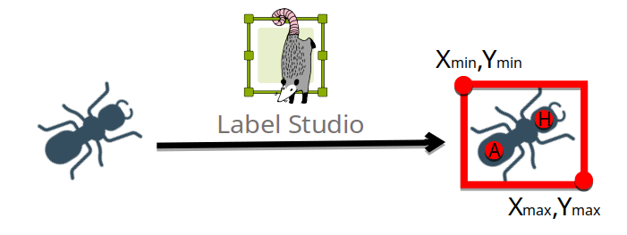
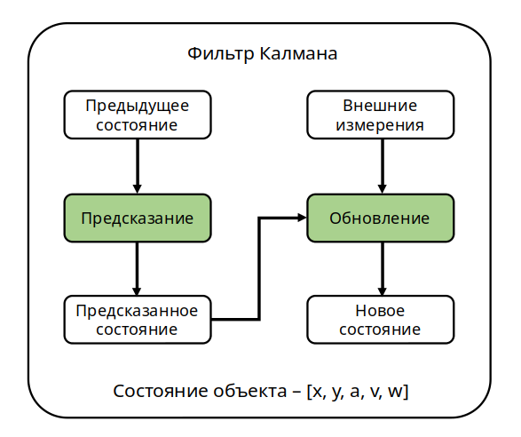

# Ant detection
## Вступление
В настоящее время в робототехнике активно развивается направление создания биоподобных систем. Муравьиная семья – интересный и информативный модельный объект для их формирования.

При работе с муравьями биологам необходимо описывать их поведение. Самым доступным способом это сделать является наблюдение. Исследование данных с видеозаписей имеет преимущество над наблюдением в реальном времени: это точнее и более информативно. Однако, вместе с этим, занимает много времени.

Для частичной автоматизации процесса предлагается сделать детектор муравьев на видеозаписях, для последующей обработки данных, полученных от детектора.

## Данные
1. Трёхканальные изображения
2. Разметка объектов проводится через утилиту **Label Studio** и  дает выход в формате *.json*, один файл для всех изображений.
3. Описание объекта представляет из себя:
    - Ограничивающую рамку. Описывается двумя точками: левой верхней точкой и правой нижней.
    - Ключевые точки. Точка, обозначающая центр головы - H. Точка, обозначающая центр брюшка - A.
    

С инструкцией и форматом разметки можно ознакомиться в [файле](./label_studio.md).
А получить предварительно размеченный датасет можно по [ссылке](https://www.kaggle.com/datasets/elizamoscovskaya/ant-2-keypoints-dataset)

## Архитектура детектора
В качестве детектора используется:
1. Модель: *Keypoint R-CNN*
2. Магистраль: *ResNet-50-FPM (Feature Pyramid Network)*
3. Фреймворк: *Pytorch*

| Имя/Дата | Датасет | Точность mAP | Ошибка ключевых точек |
| --- | --- | --- | --- |
| 20230216-180517 | ant-2-keypoints-dataset | 0.92 | 0.4 радиана |

### Обучение
Данные для обучения переводятся в формат *DataLoader*. Для этого нужно распарсить полученные данные с разметчика. Для этого нужно запустить файл *parser.py*. Затем файл *universal_intersection.py*, который разрежет изображения на указанное количество частей по вертикали и горизонтали, и разделит оригинальные аннотации для новых изображений.

Полученные данные можно передавать в обучение, запустите файл *RCNN_model.py*.

### Тестирование
Тестирование может проводиться в одном из трех режимов:
1. Тестирование на единственном изображении
2. Тестирование на пакете изображений
3. Тестирование на видео

Данные для тестирования также переводятся в формат *DataLoader*, однако разрезать изображения не нужно, так что достаточно запустить файл *parser.py* (только для изображений, т.к. для них доступно отображение настоящей разметки. Для видео доступно отображение только предиктов).

Полученные данные можно передавать в тестирование, запустите файл *universal_RCNN_test.py*. 

## Архитектура отслеживания
В качестве метода оценки положения используется расширенный фильтр Калмана. В файле *ekf.py* находится описание класса фильтра, его использование описано в файле *ekf_tracker_test.py*. Работа фильтра заключается в предсказании нового состояния по старому, а также в обновлении этого состояния по внешним измерениям. Внешние измерения это те, что получаются на выходе от детектора. Состояние объекта описывается пятью величинами: координатами x,y центра объекта, углом, скоростью и угловой скоростью. 

## Инструкция по запуску скриптов
Для компиляции следующих файлов, установите модули:

    pip3 install json numpy glob os shutil argparse opencv-python pycocotools torch torchvision albumentations datetime matplotlib yaml time collections filterpy
    

Файлы *engine.py*, *group_by_aspect_ratio.py*, *presets.py*, *train.py*, *transforms.py*, *utils.py*, *coco_eval.py*, *coco_utils.py* используются для обучения и тестирования модели детектора.

Обучение и тестирование модели рекомендуется выполнять используя вычисления *cuda*. Инструкция по установке находится в [файле](./how_to_install_cuda.md).
    
### parser.py
Этот скрипт разбирает аннотации из *.json* файла (сгенерированным приложением *Label Studio*) на файлы с ключевыми точками и боксами для каждого изображения формата *.txt*. В директории должна быть папка images, в которой лежат все изображения. Скрипт создаст в указанной директории еще две папки:
1. *bboxes* - папка с файлами для каждого изображения, с соответствующими ему координатами обрамляющих рамок объектов. Файлы формата *.txt*. В каждой строке координаты в слеующем порядке: *xmin*, *ymin*, *xmax*, *ymax*.
2. keypoints -папка с файлами для каждого изображения, с соответствующими ему координатами ключевых точек объектов. Файлы формата *.txt*. В каждой строке координаты в следующем порядке: *x_abdomen*, *y_abdomen*, *x_hed*, *y_head*.

Чтобы запустить скрипт, нужно передать параметры **в следующем порядке**:
- *root_path*. Полный путь к директории, в которой будут сохранены распарсенные данные. В этот папке должна быть папка с именем *images*, со всеми изображениями, по которым есть разметка в *JSON* файле. type = str.
- *json_path*. Полный путь к *JSON* файлу, что нужно распарсить. type = str.

### universal_intersection.py
Создает набор данных для обучения модели. Разрезает исходные изображение на 4 части, с пересечением, и изменяет координаты ключевых точек и ограничивающих боксов. 

Чтобы запустить скрипт, нужно передать параметры **в следующем порядке**:
- *old_root*. Полный путь к директории, с исходными данными, внутри которой папки: *images*, *keypoints*, *bboxes*. type = str.
- *new_root*. Полный путь к директории, где будут сохранены новые данные. type = str.
- *overlay_w*. Количество пикселей, которые пересекают изображения по оси X. type = int.
- *overlay_h*. Количество пикселей, которые пересекают изображения по оси Y. type = int.
- *splits_vertical*. Количество частей, на которое будет разделено изображение по ширине. type = int.
- *splits_horizontal*. Количество частей, на которое будет разделено изображение по высоте. type = int.

### RCNN_model.py
Класс *COCOeval* настроен на поиск 17 ключевых точек. Для данной работы нам необходимо находить только две точки, поэтому перед запуском убедитесь, что в файле *coco_eval.py* строка:

    self.coco_eval[iou_type] = COCOeval(coco_gt, iouType=iou_type)
    
Закомментирована и заменена следующим блоком:
    
    coco_eval = COCOeval(coco_gt, iouType=iou_type)
    coco_eval.params.kpt_oks_sigmas = np.array([.5, .5]) / 10.0
    self.coco_eval[iou_type] = coco_eval

Скрипт обучает модель, по окончании, сохраняет веса обученной модели в папку с именем времени запуска обучения. Нужно передать параметры **в следующем порядке**:
- *root_path*. Укажите абсолютный путь к корневой папке, где находятся папки с данными для обучения (с именем *Train_data*) и тестирования (*Test_while_train_data*). Оба набора данных должны быть с разрезанными изображениями. type = str.
- *num_epoch*. Укажите количество эпох для обучения. type = int.
- *train_batch_size*. Укажите размер батча для обучения. type = int.
- *test_batch_size*. Укажите размер батча для тестирования. type = int.
- *device*. Передайте 'cpu' в качестве параметра, чтобы обучение происходило на процессоре или 'gpu', чтобы вычисление происходило на видеокарте *Nvidia*. type = str.
- *optim*. Параметр оптимизатора, на текущий момент доступен только SGD. type = str.
- *learning_rate*. Задайте скорость обучения. type = float.
- *weight_decay*. Параметр добавляет штраф L2 к стоимости, что может привести к уменьшению веса модели. type = float.
- *lr_step*. Шаг, с которым скорость обучения будет уменьшаться. type = int.

### universal_RCNN_test.py
Скрипт теститует модель на выбор: на отдельном изображении, на пакете изображений или на видео.

Чтобы запустить скрипт, нужно передать параметры **в следующем порядке**:
- *test_data_path*. Полный путь к изображени, к видео, или к папке с изображениями. type = str.
- *model_path*. Полный путь к файлу с весами модели (расширение *.pth*). type = str.
- *draw_targets*. Флаг, отвечающий за прорисовку таргетов. True - нарисует таргеты, False - нет. type = bool. **Внимание! Если хотите выполнить предсказания на видео, передайте False**
- *nms_threshold*. Порог NMS(Non maximum supression) для боксов. type = float.
- *iou_threshold*. Порог IoU(intersection over union) для боксов. type = float.
- *overlay_w*. Количество пикселей, которые пересекают изображения по оси X. type = int.
- *overlay_h*. Количество пикселей, которые пересекают изображения по оси Y. type = int.
- *splits_vertical*. Количество частей, на которое будет разделено изображение по ширине. type = int.
- *splits_horizontal*. Количество частей, на которое будет разделено изображение по высоте. type = int.

### ekf_tracker_test.py
Скрипт обрабатывает видео на предмет сопоставления детекций между кадрами. Чтобы запустить скрипт, нужно передать параметры **в следующем порядке**:
- *yaml_path*. Полный путь до файла с предсказаниями детектора. type = str.
- *video_path*. Полный путь до оригинального видео. type = str.
- *pic_save_path*. Полный путь до папки, куда будут сохраняться все кадры видео с анализом фильтра Калмана. type = str.
- *tracks_save_path*. Полный путь до файла формата *.yml*, куда будут записаны все отфильтрованные траектории. type = str.
- *visualisation*. Параметр, определяющий будут ли пошагово визуализироваться результаты (True), либо же без визуализации траектории будут записаны в файл (False). type = bool.

## Инструкция по запуску скриптов второстепенной важности
### augmentation.py
Скрипт для увеличения данных обучения. Выделяет области муравьев бОльшего масштаба и переводит аннотации под новые изображения. Чтобы запустить скрипт, нужно передать параметры **в следующем порядке**:
- *new_root_path*. Полный путь до папки, где будет создан новый датасет.
- *old_root_path*. Полный путь до папки, где находится оригинальный датасет с аннотациями.

### data_generator.py
Скрипт для генераци синтетических данных, для тестирования модели. Чтобы запустить скрипт, нужно передать параметры **в следующем порядке**:
- *root_path*. Полный путь до корневой папки проекта. type = str
- *background_path*. Полный путь до папки, содержащей картинки заднего фона. type = str.
- *amound_of_data*. Количество изображений, которые нужно сгенерировать. type = int.
- *im_size*. Размер генерируемых изображений. type = tuple.
- *min_ants*. Минимальное количество муравьев на одной изображении. type = int.
- *max_ants*. Максимальное количество муравьев на одной изображении. type = int.
- *min_body_r*. Минимальный радиус тела муравья. type = int.
- *max_body_r*. Максимальный радиус тела муравья. type = int.
- *p*. Коэффициент, отображающий отношение размера головы к размеру брюшка. type=float.
- *gauss_var_min*. Левая граница дисперсии распределения Гаусса. type = int.
- *gauss_var_max*. Правая граница дисперсии распределения Гаусса. type = int.

### dynamic_density.py
Скрипт для подсчета динамической плотности в выбранном на видео участке. Чтобы запустить скрипт, нужно передать параметры **в следующем порядке**: 
- *tracks_yaml*. Полный путь до файла с траекториями. type = str.
- *coord_yaml*. Полный путь до файла с координатами области. type = str.
- *input_video_path*. Полный путь до видео. type = str.
- *csv_path*. Полный путь до таблицы с результатами, посчитанные биологами. type = str.

### error.py
Скрипт, считающий ошибку определения параметров детектором. Нужна, для заполнени матрицы *R* в фильтре Калмана. Чтобы запустить скрипт, нужно передать параметры **в следующем порядке**: 
- *test_data_path*. Полный путь до датасета, для которого будет посчитала ошибка. type = str.
- *model_path*. Полный путь до файла с весами модели. type = str.
- *conf_threshold*. Порог уверенности для ограничивающих рамок. type = float.
- *nms_threshold*. Порог коэффициента *NMS* для ограничивающих рамок. type = float.
- *iou_threshold*. Порог коэффициента *IOU* для ограничивающих раомк на границы пересечения. type=float.
- *overlay_w*. Количество пикселей, которые пересекают изображения по оси X. type = int.
- *overlay_h*. Количество пикселей, которые пересекают изображения по оси Y. type = int.
- *splits_vertical*. Количество частей, на которое будет разделено изображение по ширине. type = int.
- *splits_horizontal*. Количество частей, на которое будет разделено изображение по высоте. type = int.

### frame_by_frame.py
Скрипт, позволяющий визуализировать предсказания из файла покадрово, переключая кадры стрелочками. Чтобы запустить скрипт, нужно передать параметры **в следующем порядке**: 
- *video_path*. Полный путь до видео. type = str.
- *yaml_path*. Полный путь до файла с детекциями. type = str.

### mAP.py
Скрипт, позволяющий измерить точность детектора по критерию *Average Precision*. Чтобы запустить скрипт, нужно передать параметры **в следующем порядке**: 
- *test_path*. Полный путь до датасета. type = str.
- *iuo_tresh*. Пороговое значение *IoU* для определения детекции к *true positive* или *false negative*. type=float
- *model_path*. Полный путь до файла с весами модели. type = str.
- *conf_threshold*. Порог уверенности для ограничивающих рамок. type = float.
- *nms_threshold*. Порог коэффициента *NMS* для ограничивающих рамок. type = float.
- *iou_threshold*. Порог коэффициента *IOU* для ограничивающих раомк на границы пересечения. type = float.
- *overlay_w*. Количество пикселей, которые пересекают изображения по оси *X*. type = int.
- *overlay_h*. Количество пикселей, которые пересекают изображения по оси *Y*. type = int.
- *splits_vertical*. Количество частей, на которое будет разделено изображение по ширине. type = int.
- *splits_horizontal*. Количество частей, на которое будет разделено изображение по высоте. type = int.

### mouse_event.py
Скрипт, позволяющий выбрать область на видео, где будет производиться подсчет динамической области. Сохраняет координаты области в файл формата *.yml*. Чтобы запустить скрипт, нужно передать параметры **в следующем порядке**: 
- *video_path*. Полный путь до видео, на котором нужно выбрать область. type = str.
- *yaml_path*. Полный путь до файла формата *.yml* куда будут сохранены координаты области. type = str.

### read_tracks_from_yml.py
Скрипт, визуализирующий треки из файла, полученного после обработки фильтром Калмана. Чтобы запустить скрипт, нужно передать параметры **в следующем порядке**: 
- *yml_path*. Полный путь до файла с траекториями. type = str.
- *yml_path*. Полный путь до видео. type = str.

### evaluate.py
Скрипт, считающий точность всех моделей на разных датасетах. Чтобы запустить скрипт, нужно передать параметры **в следующем порядке**: 
- *models_path*. Полный путь до папки, где лежат папки с весами моделей. type = str.
- *iuo_tresh*. Пороговое значение *IoU* для определения детекции к *true positive* или *false negative*. type=float
- *conf_threshold*. Порог уверенности для ограничивающих рамок. type = float.
- *nms_threshold*. Порог коэффициента *NMS* для ограничивающих рамок. type = float.
- *iou_threshold*. Порог коэффициента *IOU* для ограничивающих раомк на границы пересечения. type = float.
- *overlay_w*. Количество пикселей, которые пересекают изображения по оси *X*. type = int.
- *overlay_h*. Количество пикселей, которые пересекают изображения по оси *Y*. type = int.
- *splits_vertical*. Количество частей, на которое будет разделено изображение по ширине. type = int.
- *splits_horizontal*. Количество частей, на которое будет разделено изображение по высоте. type = int.

