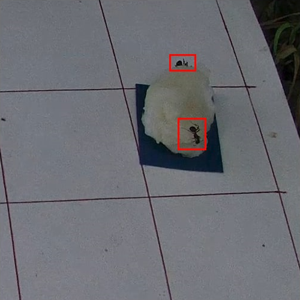
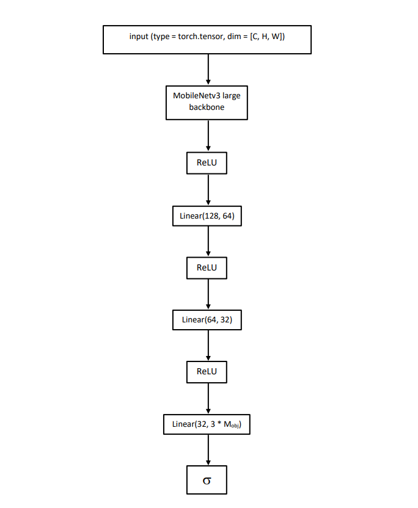

# Ant detection
## Вступление
В настоящее время в робототехнике активно развивается направление создания биоподобных систем. Муравьиная семья – интересный и информативный модельный объект для их формирования.

При работе с муравьями биологам необходимо описывать их поведение. Самым доступным способом это сделать является наблюдение. Исследование данных с видеозаписей имеет преимущество над наблюдением в реальном времени: это точнее и более информативно. Однако, вместе с этим, занимает много времени.

Для частичной автоматизации процесса предлагается сделать детектор муравьев на видеозаписях, для последующей обработки данных, полученных от детектора.
## Данные
1. Трёхканальные изображения
2. Разметка объектов для каждого изображения в формате *.xml*.

-><-

## Архитектура
Детектирование будет реализованно используя фреймворк **Pytorch**.

Схема архитектуры модели:

-><-

Вход модели - пакет тензоров (изображений) размерностью [C, H, W], где С - количество каналов изображения, с нашем случае С = 3, т.к. изображения цветные. H, W - размеры изображения в пикселях, для этой модели требуются изображения размерами 320х320.

Вход изначально обрабатывается свёрточным энкодером MobileNetv3 Large, затем полученные признаки проходят через стягивающие слои к тензору [P, X, Y], где P - вероятность, X и Y - координаты объекта. 

На выходе модель имеет два тензора:
1. Тензор размерностью [B, Max_obj] с предсказаниями классификации. Где Max_obj - задаваемый параметр, означающий максимальное значение объектов на одном изображении.
2. Тензор размерностью [B, Max_obj, 2] с предсказанными координатами.
## Файлы и параметры запуска
### model.py
В данном файле находится архитектура модели для обучения.
### model_train.py
Этот файл предназначен для обучения модели. Чтобы начать обучение, запустите скрипт в терминале и передайте параметры **в следующем порядке**:
- *Number of epochs.* Type=int.
- *Batch size.* Type=int.
- *Training directory.* Полный путь каталога, в котором хранятся данные для обучения: RGB изображения и .xml файлы с размеченными ограничивающими рамками. Type=str.
- *Model directory.* После каждого запуска в этом каталоге будет создаваться папка, в имени которой дата запуска. В папке будут храниться параметры лучшей модели (модели, у которых потери минимальны), полностью обученной модели и loss-графа. Type=str.
- *Learning rate.* Введите скорость обучения для оптимизатора (сейчас используется Адам). Type=float.
- *Maximum objects.* Введите максимальное количество объектов, которое может быть обнаруженно на изображении. Type=int.

При запуске этого файла, вам будет выводится картинка, на которой будут отмечены реальные объекты, а так же предсказания сделанной моделью в начале и конце эпохи. По завершении работы программы, будет создана директория с именем времени запуска, где будут храниться параметры обученной модели.
### model_test.py
Этот файл предназначен для тестирования обученной модели. Возвращает изображение с предсказанными и истинными положениями объектов. Запустите скрипт в терминале и передайте параметры **в следующем порядке**:
- *Load path.* Полный путь к модели для загрузки и тестирования. Type=str.
- *Image path.* Полный путь к изображению, на котором будет выполнено тестирование. Type=str.

## KEYPOINT MODEL
### parser.py
Этот скрипт разбирает аннотации из *.json* файла (сгенерированным приложением *Label Studio*) на файлы с ключевыми точками и боксами для каждого изображения формата *.txt*. В директории должна быть папка images, в которой лежат все изображения. Скрипт создаст в указанной директории еще две папки:
1. bboxes - папка с файлами для каждого изображения, с соответствующими ему координатами обрамляющих рамок объектов. Файлы формата .txt. В каждой строке координаты в слеующем порядке: xmin, ymin, xmax, ymax.
2. keypoints -папка с файлами для каждого изображения, с соответствующими ему координатами ключевых точек объектов. Файлы формата .txt. В каждой строке координаты в следующем порядке: x_abdomen, y_abdomen, x_hed, y_head.

Для запуска, должны быть установлены следующие модули: *json*, *numpy*, *glob*, *os*, *shutil*, *argparse*.

Чтобы запустить скрипт, нужно передать параметры **в следующем порядке**:
- *root_path*. Полный путь к директории, в которой будут сохранены распарсенные данные. В этот папке должна быть папка с именем *images*, со всеми изображениями, по которым есть разметка в JSON файле. type = str.
- *json_path*. Полный путь к JSON файлу, что нужно распарсить. type = str.

### overlay_intersection.py
Создает набор данных для обучения модели. Разрезает исходные изображение на 4 части, с пересечением, и изменяет координаты ключевых точек и ограничивающих боксов. 

Для запуска, должны быть установлены следующие модули: *os*, *cv2*, *shutil*, *argparse*.

Чтобы запустить скрипт, нужно передать параметры **в следующем порядке**:
- *old_root*. Полный путь к директории, с исходными данными, внутри которой папки: *images*, *keypoints*, *bboxes*. type = str.
- *new_root*. Полный путь к директории, где будут сохранены новые данные. type = str.
- *overlay_w*. Количество пикселей, которые пересекают изображения по оси X. type = int.
- *overlay_h*. Количество пикселей, которые пересекают изображения по оси Y. type = int.

### RCNN_model.py
Прежде, чем запустить этот скрипт, установите библиотеку *pycocotools* командой *pip install pycocotools* откройте файл *pycocotools/cocoeval.py* (он будет примерно по следующему пути: /usr/local/lib/python3.7/dist-packages/pycocotools/cocoeval.py), и замените 523 строку на

    self.kpt_oks_sigmas = np.array([.5, .5])/10.0
    
Для запуска, должны быть установлены следующие модули: *torchvision*, *argparse*, *albumentations*, *datetime*, *torch*, *os*, *numpy*, *openCV*, *matplotlib*.

Скрипт обучает модель, по окончании, сохраняет веса обученной модели в папку с именем времени запуска обучения. Нужно передать параметры **в следующем порядке**:
- *root_path*. Укажите абсолютный путь к корневой папке, где находятся папки с данными для обучения (с именем *Train_data*) и тестирования (*Test_while_train_data*). Оба набора данных должны быть с разрезанными изображениями. type = str.
- *num_epoch*. Укажите количество эпох для обучения. type = int.

### RCNN_overlay_test.py
Скрипт теститует модель на выбор: на отдельном изображении, на пакете изображений или на видео.

Для запуска, должны быть установлены следующие модули: *torchvision*, *numpy*, *argparse*, *cv2*, *os*, *glob*, *torch*.

Чтобы запустить скрипт, нужно передать параметры **в следующем порядке**:
- *test_data_path*. Полный путь к изображени, к видео, или к папке с изображениями. type = str.
- *model_path*. Полный путь к файлу с весами модели (расширение *.pth*). type = str.
- *draw_targets*. Флаг, отвечающий за прорисовку таргетов. True - нарисует таргеты, False - нет. type = bool. **Внимание! Если хотите выполнить предсказания на видео, передайте False**
- *nms_threshold*. Порог NMS(Non maximum supression) для боксов. type = float.
- *iou_threshold*. Порог IoU(intersection over union) для боксов. type = float.
- *overlay_w*. Количество пикселей, которые пересекают изображения по оси X. type = int.
- *overlay_h*. Количество пикселей, которые пересекают изображения по оси Y. type = int.
