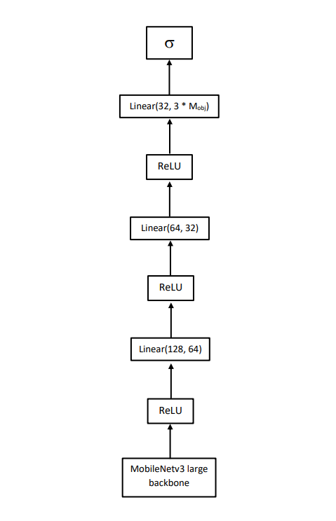

# Ant detection
## Вступление
В настоящее время в робототехнике активно развивается направление создания биоподобных систем. Муравьиная семья – интересный и информативный модельный объект для их формирования.
При работе с муравьями биологам необходимо описывать их поведение. Самым доступным способом это сделать является наблюдение. Исследование данных с видеозаписей имеет преимущество над наблюдением в реальном времени: это точнее и более информативно. Однако, вместе с этим, занимает много времени.
Для частичной автоматизации процесса предлагается сделать детектор муравьев на видеозаписях, для последующей обработки данных, полученных от детектора.
## Данные
1. Трёхканальные изображения
2. Разметка объектов для каждого изображения в формате *.xml*.
## Архитектура
Детектирование будет реализованно используя фреймворк **Pytorch**.
Схема архитектуры модели:

Вход модели - пакет тензоров (изображений) размерностью [C, H, W], где С - количество каналов изображения, с нашем случае С = 3, т.к. изображения цветные. H, W - размеры изображения в пикселях, для этой модели требуются изображения размерами 320х320.
Вход изначально обрабатывается свёрточным энкодером MobileNetv3 Large, затем полученные признаки проходят через стягивающие слои к тензору [P, X, Y], где P - вероятность, X и Y - координаты объекта. 
На выходе модель имеет два тензора:
1. Тензор размерностью [B, Max_obj] с предсказаниями классификации. Где Max_obj - задаваемый параметр, означающий максимальное значение объектов на одном изображении.
2. Тензор размерностью [B, Max_obj, 2] с предсказанными координатами.
## Файлы и параметры запуска
### model.py
В данном файле находится архитектура модели для обучения.
### model_train.py
Этот файл предназначен для обучения модели. Чтобы начать обучение, запустите скрипт в терминале и передайте параметры **в следующем порядке**:
- *Number of epochs.* Type=int.
- *Batch size.* Type=int.
- *Training directory.* Полный путь каталога, в котором хранятся данные для обучения: RGB изображения и .xml файлы с размеченными ограничивающими рамками. Type=str.
- *Model directory.* После каждого запуска в этом каталоге будет создаваться папка, в имени которой дата запуска. В папке будут храниться параметры лучшей модели (модели, у которых потери минимальны), полностью обученной модели и loss-графа. Type=str.
- *Learning rate.* Введите скорость обучения для оптимизатора (сейчас используется Адам). Type=float.
- *Maximum objects.* Введите максимальное количество объектов, которое может быть обнаруженно на изображении. Type=int.
При запуске этого файла, вам будет выводится картинка, на которой будут отмечены реальные объекты, а так же предсказания сделанной моделью в начале и конце эпохи. По завершении работы программы, будет создана директория с именем времени запуска, где будут храниться параметры обученной модели.
### model_test.py
Этот файл предназначен для тестирования обученной модели. Возвращает изображение с предсказанными и истинными положениями объектов. Запустите скрипт в терминале и передайте параметры **в следующем порядке**:
- *Load path.* Полный путь к модели для загрузки и тестирования. Type=str.
- *Image path.* Полный путь к изображению, на котором будет выполнено тестирование. Type=str.
