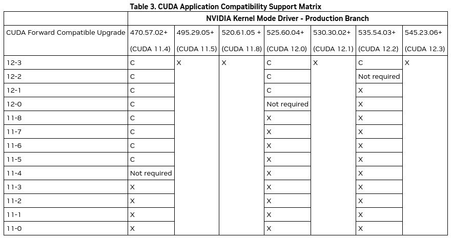

# Установка CUDA на Linux Ubuntu (Для фрейморка PyTorch)
## Шаг 1
Перейдите на сайт <https://pytorch.org/> найдите подходящую версию *cuda* для ваших нужд (зависит от модели или пакетов). 
## Шаг 2 
Сверьтесь с таблицей. Найдите версию драйвера для вашей видеокарты совместирую с выбранной версией *cuda*.

## Шаг 3
Проверьте, какие версии драйверов доступны для вашей видеокарты *Nvidia*.

    ubuntu-drivers devices
    
## Шаг 4
Установите версию драйвера с помощью apt: sudo apt install nvidia-driver-"версия драйвера", например:

    sudo apt install nvidia-driver-515
    
## Шаг 5
Перезагрузите компьютер. Обновите списки пакетов следующей командой:

    sudo apt update
    
## Шаг 6
Для установки *cuda Ubuntu* выполните следующую команду:

    sudo apt install nvidia-cuda-toolkit

Если вам также нужны заголовочные файлы для разработки, то понадобится дополнительно установить пакет nvidia-cuda-dev:

    sudo apt install nvidia-cuda-dev
    
Чтобы проверить, что *cuda* установилась верно, выполните команду:

    nvcc -v
    
## Шаг 7
Перезагрузите компьютер. Вернитесь на сайт <https://pytorch.org/> и получите команду для установки *PyTorch*.
## Шаг 8 
Проверьте работу, узнав, доступна ли *cuda* в фреймворке *PyTorch*:

    import torch
    torch.cuda.is_available()
