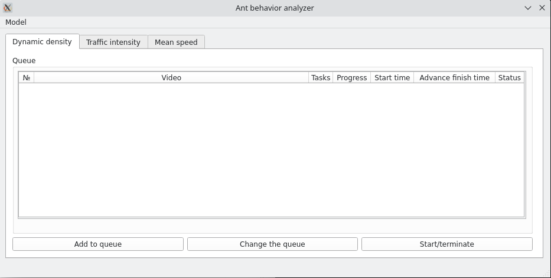
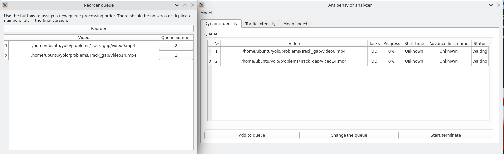
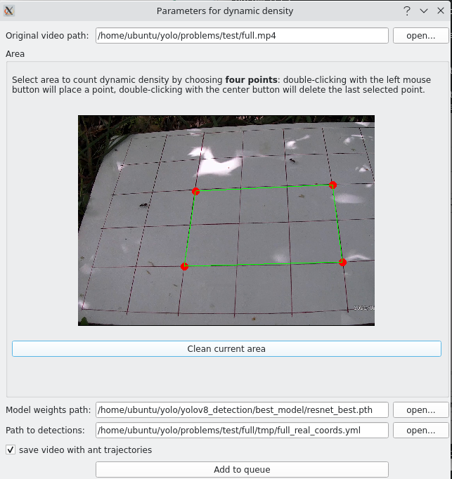
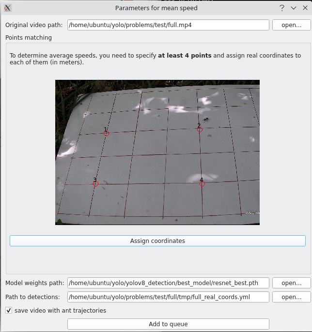
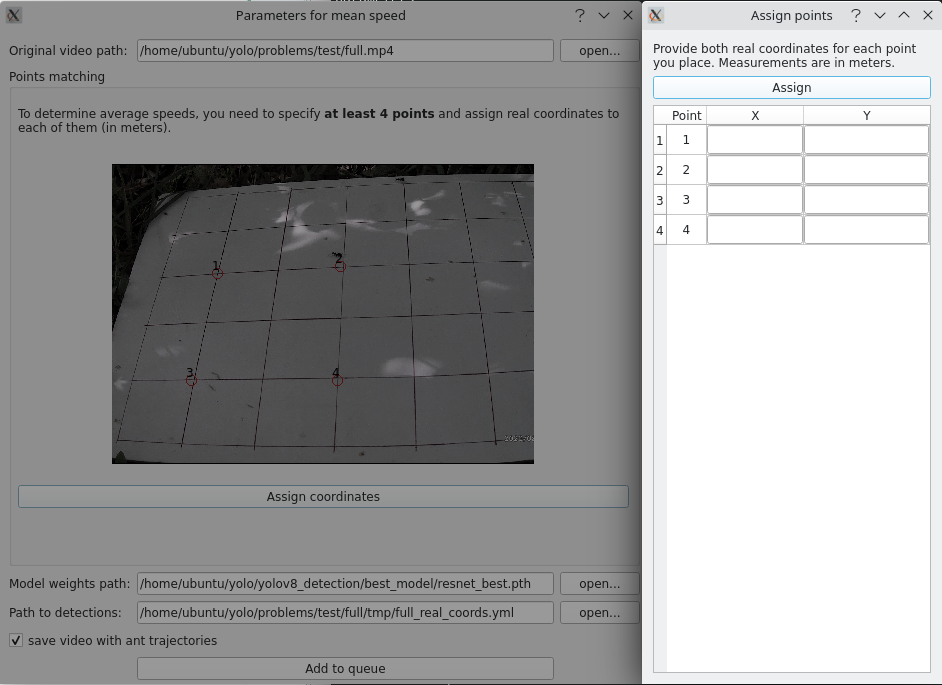

# Инструкция по использованию приложения

## Оглавление
* [Запуск приложения](#запуск-приложения)
* [Выбор модели](#выбор-модели)
* [Общие правила](#общие-правила)
* [Расчет динамической плотности муравьев](#расчет-динамической-плотности-муравьев)
* [Расчет интенсивности движения муравьев](#расчет-интенсивности-движения-муравьев)
* [Расчет средней скорости движения муравьев](#расчет-средней-скорости-движения-муравьев)

## 1. Запуск приложения
Откройте терминал и перейдите в корень директории проекта командой:

    cd /home/ubuntu/yolo/yolov8_detection/

Запустите графический интерфейс с помощью команды:

    python3 desktop.py

Должно появиться следующее окно:

## 2. Выбор модели
Обработка видеофайлов доступна двумя моделями
- **Yolo** Более быстрая модель, но с меньшей точностью. Хороша для лабораторных наблюдений.
- **ResNet** Медленная, но более точная модель. Хорошая для постобработки.

При указании типа модели в меню приложения *"Models"*, лучшие веса будут автоматически подгружаться для каждой задачи и путь к ним не нужно будет указывать.

## 3. Общие правила
### 3.1. Правила названия видеофайлов
Имя и путь к файлам должен быть на латинице, без использования следующих символов: /'"_ и пробелов.
### 3.2. Результаты обработки
По завершении обработки рядом с видеофайлом будет создана директория с именем видеофайла, внутри этой директории будут находиться две папки:
- **results** Папка с непосредственными результатами. Там будет сохранено исходное видео с нанесенными траекториями передвижения муравьев, а также либо график, либо excel-таблица с результатами расчета количественных характеристик.
- **tmp** Папка с промежуточными результатами. Содержит файл с детекциями, траекториями и матрицей перспективного преобразования. Эту папку не стоит удалять, если планируется неодкратная обработка одного файла (например разными задачами), тогда скорость обработки увеличится.
### 3.3. Общие элементы каждой формы
Каждая страница представляет из себя очередь обрабатываемых файлов для конкретной задачи. На каждой странице есть три кнопки:
- **Add to queue** кнопка добавления задачи в очередь. Открывает окно, в котором надо выбрать обрабатываемое видео и параметры расчета количественных характеристик. По окончании выбора параметров задача добавится в очередь.
- **Change the queue** кнопка изменения порядка обработки задач. В случае, если нужно поменять приоритет выполняемых задач, можно нажать эту кнопку и изменить приоритет для задач, что ожидают обработки. Новый номер порядка обработки назначается цифрой в правом столбике открывающего окна. Чтобы изменить номер - нужно кликать мышкой по соответствующей ячейке.

    

- **Start/terminate** при первом нажатии запускает обработку очереди, при повторном нажатии всплывает окно подтверждения прерывания очереди. Если подтвердить, то текущая задача обработается до конца, а выполнение слеующих в очереди не начнется. Это безопасное прерывание. В случае, если остановить обработку нужно немедленно следует просто закрыть приложение или нажать сочетаний клавишь Ctrl + C в терминале.

### 4. Расчет динамической плотности муравьев
Очередь для обработки этого типа задач находится на первой вкладке *"Dynamic density"* главного окна. При нажатии кнопки **Add to queue** откроется окно выбора параметров.

1. В первую очередь нужно указать путь до видео в самой верхней строке. Можно прописать путь в поле вручную, а можно нажать кнопку *open...* правее и откроется проводник.
2. Видео начнет проигрываться в окне, вам же нужно выбрать ровно 4 точки, которые ограничивают область, для которой будет вестись подсчет. Чтобы поставить точку дважды кликните левой кнопкой мыши по области видео. Чтобы отменить последнюю точку дважды кликните правой кнопкой мыши в любой области видео. Когда вы отметите все точки они соединятся в полигон. Вы можете удалить полигон, нажатием кнопки *Clean  current area* и нарисовать его заново.
3. Далее поле для указания весов для модели. В этом поле автоматически указывается путь до лучшей модели, но в случае необходимости значение этого поля можно изменить вручную или через проводник.
4. Затем вы можете указать путь до детекций этого конкретного видео, это ускорит время обработки. Если данное видео обрабатывалось на текущем ПК, то детекции будут найдены автоматически.
5. Последняя галочка стоит в поле, которое отвечает за сохранение видео с траекториями. Если память ограничена, или вы хотите ускорить процесс обработки, можете снять галочку.
6. Все параметры заполнены, нажмите кнопку *"Add to queue"*, чтобы поставить задачу в очередь.

### 5. Расчет интенсивности движения муравьев
Очередь для обработки этого типа задач находится на второй вкладке *"Traffic intensity"* главного окна. При нажатии кнопки **Add to queue** откроется окно выбора параметров.

1. В первую очередь нужно указать путь до видео в самой верхней строке. Можно прописать путь в поле вручную, а можно нажать кнопку *open...* правее и откроется проводник.
2. Видео начнет проигрываться в окне, вам же нужно выбрать ровно 2 точки, через которые будет проходить прямая, пересечение через которую будет учитываться при расчете интенсивности движения. Чтобы поставить точку дважды кликните левой кнопкой мыши по области видео. Чтобы отменить последнюю точку дважды кликните правой кнопкой мыши в любой области видео. Когда вы отметите все точки, через них будет проведена прямая. Вы можете удалить линию, нажатием кнопки *Clean  current line* и нарисовать её заново.
3. Далее поле для указания весов для модели. В этом поле автоматически указывается путь до лучшей модели, но в случае необходимости значение этого поля можно изменить вручную или через проводник.
4. Затем вы можете указать путь до детекций этого конкретного видео, это ускорит время обработки. Если данное видео обрабатывалось на текущем ПК, то детекции будут найдены автоматически.
5. Последняя галочка стоит в поле, которое отвечает за сохранение видео с траекториями. Если память ограничена, или вы хотите ускорить процесс обработки, можете снять галочку.
6. Все параметры заполнены, нажмите кнопку *"Add to queue"*, чтобы поставить задачу в очередь.

### 6. Расчет средней скорости движения муравьев
Очередь для обработки этого типа задач находится на третьей вкладке *"Mean speed"* главного окна. При нажатии кнопки **Add to queue** откроется окно выбора параметров.

1. В первую очередь нужно указать путь до видео в самой верхней строке. Можно прописать путь в поле вручную, а можно нажать кнопку *open...* правее и откроется проводник.
2. Видео начнет проигрываться в окне, вам же нужно выбрать не менее 4-х точек, для которых вы укажите реальные координаты. Чтобы поставить точку дважды кликните левой кнопкой мыши по области видео. Чтобы отменить последнюю точку дважды кликните правой кнопкой мыши в любой области видео. Когда вы отметите не менее четырех точек станет активна кнопка *Assign points* нажмите ее и заполните отношения между отмеченными точками.

    

3. Далее поле для указания весов для модели. В этом поле автоматически указывается путь до лучшей модели, но в случае необходимости значение этого поля можно изменить вручную или через проводник.
4. Затем вы можете указать путь до детекций этого конкретного видео, это ускорит время обработки. Если данное видео обрабатывалось на текущем ПК, то детекции будут найдены автоматически.
5. Последняя галочка стоит в поле, которое отвечает за сохранение видео с траекториями. Если память ограничена, или вы хотите ускорить процесс обработки, можете снять галочку.
6. Все параметры заполнены, нажмите кнопку *"Add to queue"*, чтобы поставить задачу в очередь.
