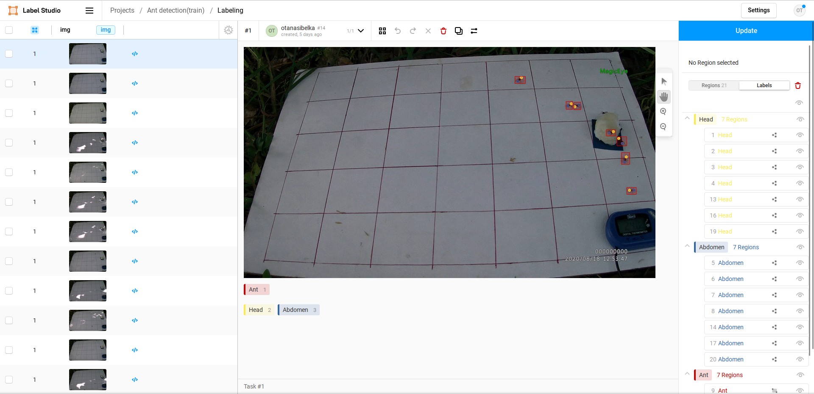

# Label Studio
## Шаг 1: Установка и запуск
- Установку произвести согласно инструкции [с официального сайта](https://labelstud.io/guide/install.html).
- Запуск программы командой терминала **label-studio** после уставновки.

Если всё выполнено правильно, то на локальном сервере откроется страница Label Studio.
## Шаг 2: Начало работы
После регистрации, можно создать свой проект, или присоединиться по ссылке к чужому.

**Создание проекта**
1. Нажимаем на Create Project.
2. Заполняем информацию о проекте, в первом окне название проекта и описание.
3. Второе окно - импорт сырых данных (импортировать данные можно позже). Label Studio поддерживает изображения слеующих форматов: jpg, png, gif, bmp, svg, webp.
4. Третье окно - Labeling Setup. Выбираем тип разметки. Для данного проекта выбираем Computer Vision, а затем Keypoint Labeling. Затем в первой строке появившегося поля переключаемся с Visual на Code и вставляем следующий шаблон:

``` json
    <View>
        <Image name="img-1" value="$img" zoom="true"/>
        <RectangleLabels name="label" toName="img-1">
            <Label value="Ant" background="#cc0000"/>
        </RectangleLabels>
        <KeyPointLabels name="kp-1" toName="img-1">
            <Label value="Head" background="#fce94f"/>
            <Label value="Abdomen" background="#3465a4"/>
        </KeyPointLabels> 
    </View>
```
5. Нажимаем на Save.

## Шаг 3: Разметка
После сохранение нас перекидывает на страницу проекта. Кнопка **Import** позволяет догружать новые данные. Третий столбик (Total annotations per task) показывает была ли произведена разметка для конкретного изображения. Второй столбик (Completed) показывает дату последнего обновления аннотаций. 

Перейдем к конкретному изображению:
- Разметку каждого объекта начинать с точек головы и брюшка и только после этого выделять область самого муравья. Чтобы переключаться между режимами разметки, можно использовать клавиши: 1 - Рамка для муравья, 2 - Точка для головы, 3 - Точка для брюшка.
- Для приближения/отдаления используйте **Ctrl + колесико мышки**.
- Чтобы ппанорамировать, нажмите клавишу **H**.
- Чтобы выбрать какой-то объект (например для изменения размера или перемещения), нажмите **V**. После окончания редактирования объекта нажмите **Esc**.
- **Обязательно** после того, как все аннотации по конкретному изображению были добавлены, нажмите минюю кнопку в правом верхнем углу. **Submit/Update**.



## Требования к разметке: 
- Размечать только тех муравьев, что целиком видны.
- Бокс объекта не должен пересекать центры точек других объектов.
- По возможности в бокс должны попадать усики и лапки объекта, если бы некоторые объекты находятся слишком близко, выделение рамок произвести таким образом, чтобы боксы не задевали чужие ключевые точки.
- Если муравьи конкретно "наезжают" друг на друга, от такого изображения следует отказаться.
